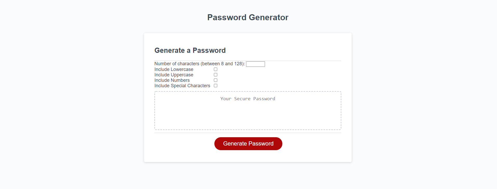

# Password-Generator
This assignment was originally assigned by the U.C. Berkeley Extension Full-time Full Stack Flex Boot Camp.
This is assignment 3 for the program. In this assignment I implemented password generator logic using Javascript for the page. After taking in the user selected prompts the program will return and display a randomly generated password that fulfills the selection. I have refactored the original intentions into using javascript DOM manipulation elements in order to take in data from the HTML forms into the javascript.

I implement logical features such as:
- A series of selectable prompts for password criteria
- length option between 8 and 128
- choice of lowercase, uppercase, numeric and/or special characters

## Built With

* [HTML](https://developer.mozilla.org/en-US/docs/Web/HTML)
* [CSS](https://developer.mozilla.org/en-US/docs/Web/CSS)
* [Javascript](https://developer.mozilla.org/en-US/docs/Web/JavaScript)

## Deployed Link

* [See Live Site](https://acedyu.github.io/password-generator/)

## Authors
AcedYu
- [Link to Github](https://github.com/AcedYu)
- [Link to LinkedIn](https://www.linkedin.com/in/alex-yu-3712811b9/)
